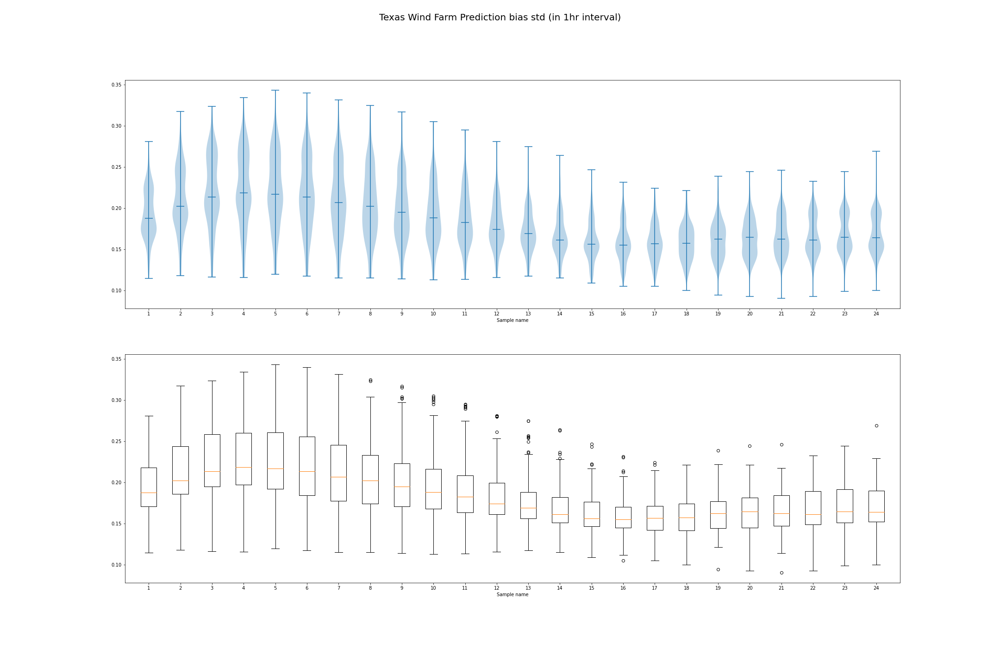

# Wind Farms

## Bias

- at night there is less bias
- negative bias in the south and north. positive bias in the middle
- **least bias** around 17:00-18:00

- two outliers at the bottom are **Canadian Breaks Wind** and **Desert Sky repower**

## Std

- low std at the south and north, high std at the middle

- low std in the afternoon and the evening