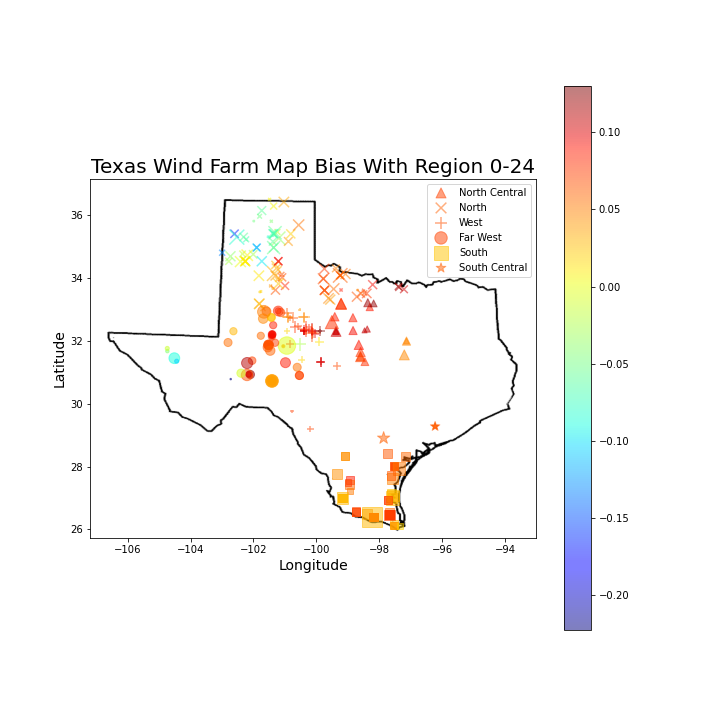
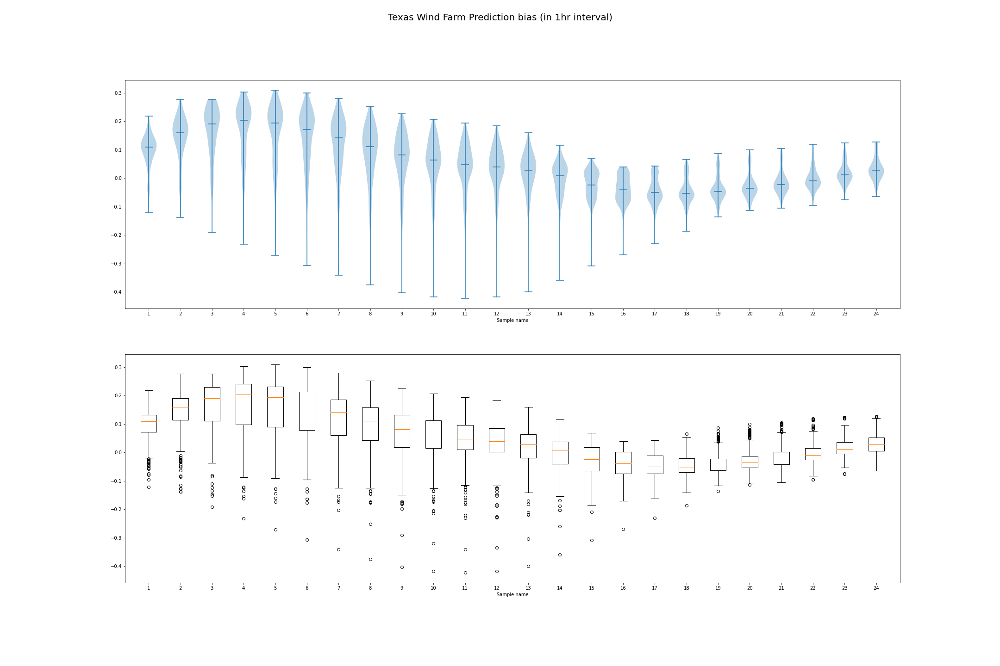
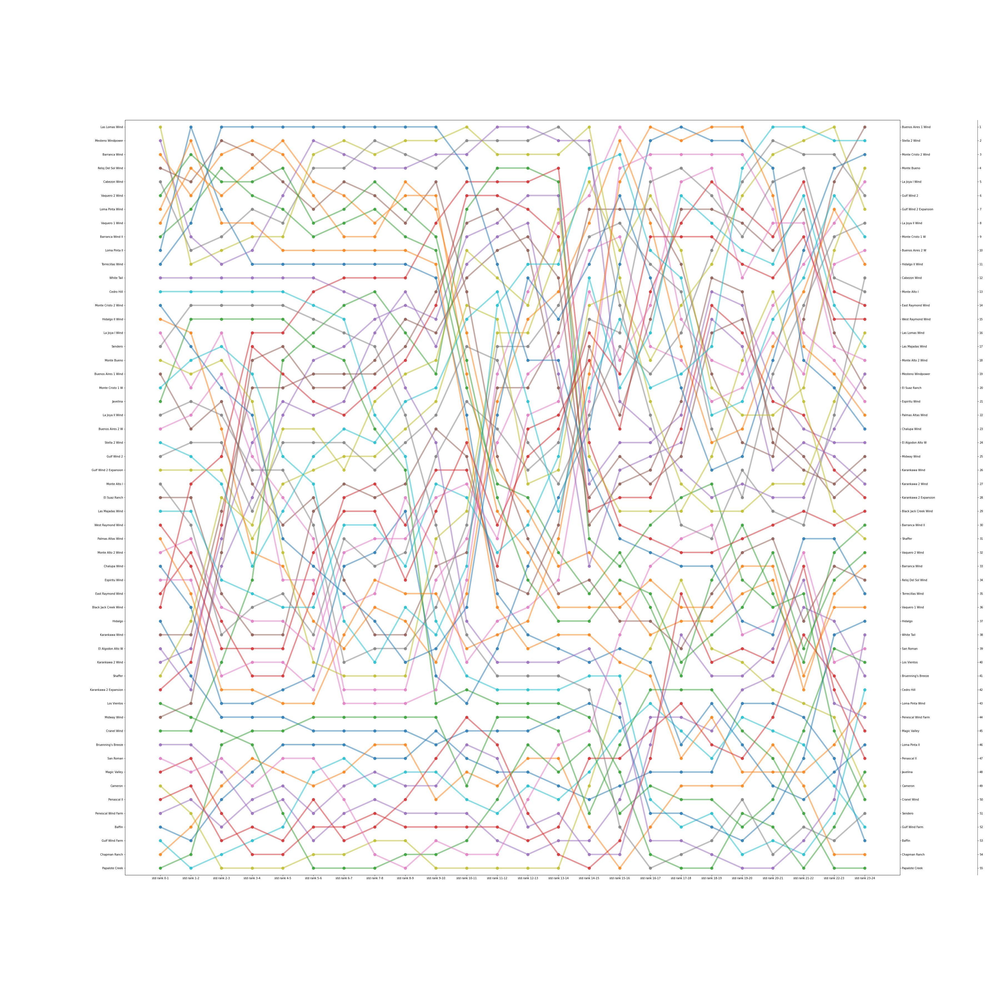

# Wind Farms Observations

## Bias

### Bias at 24 Hours interval

### Bias at each hour

- at night there is less bias
- negative bias in the south and north. positive bias in the middle
- **least bias** around 17:00-18:00

### Violin plot of bias at each hour

- two outliers at the bottom are **Canadian Breaks Wind** and **Desert Sky repower**

## Std

### Std at 24 Hours interval

- low std at the south and north, high std at the middle

### std of bias at each hour

- at the sourth std lower from midnight to noon

### Violin plot of std of bias at each hour

- low std in the afternoon and the evening

### Bump Chart of std of bias at each hour

**Kendall Coefficient of Correlation for the above bump chart**

|0-1| 1-2 | 2-3 | 3-4 | 4-5 | 5-6 | 6-7 | 7-8 | 8-9 | 9-10 | 10-11 | 11-12 | 12-13 | 13-14 | 14-15 | 15-16 | 16-17 | 17-18 | 18-19 | 19-20 | 20-21 | 21-22 | 22-23 | 23-24 |
| ----- | ----- | ----- | ----- | ----- | ----- | ----- | ----- | ----- | ----- | ----- | ----- | ----- | ----- | ----- | ----- | ----- | ----- | ----- | ----- | ----- | ----- | ----- | ----- |
|0.842 |0.871 |0.879 |0.910 |0.918 |0.918 |0.928 |0.918 |0.916 |0.916 |0.894 |0.891 |0.878 |0.833 |0.808 |0.825 |0.832 |0.853 |0.863 |0.881 |0.865 |0.846 |0.883 |

- low std farms tend to stay low, high std farms tend to stay high
- Kendall's $\tau$ is higher in the morning

#### Bump Chart of std of bias at each hour (North)

**Kendall Coefficient of Correlation for the above bump chart (North)**

|0-1| 1-2 | 2-3 | 3-4 | 4-5 | 5-6 | 6-7 | 7-8 | 8-9 | 9-10 | 10-11 | 11-12 | 12-13 | 13-14 | 14-15 | 15-16 | 16-17 | 17-18 | 18-19 | 19-20 | 20-21 | 21-22 | 22-23 | 23-24 |
| ----- | ----- | ----- | ----- | ----- | ----- | ----- | ----- | ----- | ----- | ----- | ----- | ----- | ----- | ----- | ----- | ----- | ----- | ----- | ----- | ----- | ----- | ----- | ----- |
|0.845 |0.876 |0.870 |0.915 |0.893 |0.918 |0.902 |0.856 |0.862 |0.910 |0.912 |0.891 |0.797 |0.813 |0.850 |0.864 |0.873 |0.906 |0.912 |0.889 |0.882 |0.876 |0.915 |

- Average kendall's tau is 0.879450425266163

#### Bump Chart of std of bias at each hour (South)

**Kendall Coefficient of Correlation for the above bump chart (South)**

|0-1| 1-2 | 2-3 | 3-4 | 4-5 | 5-6 | 6-7 | 7-8 | 8-9 | 9-10 | 10-11 | 11-12 | 12-13 | 13-14 | 14-15 | 15-16 | 16-17 | 17-18 | 18-19 | 19-20 | 20-21 | 21-22 | 22-23 | 23-24 |
| ----- | ----- | ----- | ----- | ----- | ----- | ----- | ----- | ----- | ----- | ----- | ----- | ----- | ----- | ----- | ----- | ----- | ----- | ----- | ----- | ----- | ----- | ----- | ----- |
|0.879 |0.826 |0.865 |0.887 |0.896 |0.890 |0.935 |0.925 |0.852 |0.795 |0.763 |0.857 |0.886 |0.698 |0.766 |0.806 |0.825 |0.851 |0.872 |0.868 |0.826 |0.780 |0.868 |

- Average kendall's tau is 0.8441809398331139

#### Bump Chart of std of bias at each hour (North Central)

**Kendall Coefficient of Correlation for the above bump chart (North Central)**

 |0-1| 1-2 | 2-3 | 3-4 | 4-5 | 5-6 | 6-7 | 7-8 | 8-9 | 9-10 | 10-11 | 11-12 | 12-13 | 13-14 | 14-15 | 15-16 | 16-17 | 17-18 | 18-19 | 19-20 | 20-21 | 21-22 | 22-23 | 23-24 |
| ----- | ----- | ----- | ----- | ----- | ----- | ----- | ----- | ----- | ----- | ----- | ----- | ----- | ----- | ----- | ----- | ----- | ----- | ----- | ----- | ----- | ----- | ----- | ----- |
|0.861 |0.905 |0.870 |0.905 |0.983 |0.844 |0.913 |0.913 |0.913 |0.905 |0.896 |0.835 |0.844 |0.887 |0.905 |0.939 |0.896 |0.861 |0.775 |0.827 |0.887 |0.913 |0.939 |

- Average kendall's tau is 0.8878223226049313

#### Bump Chart of std of bias at each hour (West)

**Kendall Coefficient of Correlation for the above bump chart (West)**

 |0-1| 1-2 | 2-3 | 3-4 | 4-5 | 5-6 | 6-7 | 7-8 | 8-9 | 9-10 | 10-11 | 11-12 | 12-13 | 13-14 | 14-15 | 15-16 | 16-17 | 17-18 | 18-19 | 19-20 | 20-21 | 21-22 | 22-23 | 23-24 |
| ----- | ----- | ----- | ----- | ----- | ----- | ----- | ----- | ----- | ----- | ----- | ----- | ----- | ----- | ----- | ----- | ----- | ----- | ----- | ----- | ----- | ----- | ----- | ----- |
|0.789 |0.868 |0.914 |0.922 |0.938 |0.927 |0.941 |0.946 |0.968 |0.951 |0.924 |0.897 |0.903 |0.892 |0.835 |0.889 |0.868 |0.800 |0.897 |0.892 |0.903 |0.849 |0.906 |

- Average kendall's tau is 0.8964970955817639

#### Bump Chart of std of bias at each hour (Far West)

**Kendall Coefficient of Correlation for the above bump chart (Far West)**

|0-1| 1-2 | 2-3 | 3-4 | 4-5 | 5-6 | 6-7 | 7-8 | 8-9 | 9-10 | 10-11 | 11-12 | 12-13 | 13-14 | 14-15 | 15-16 | 16-17 | 17-18 | 18-19 | 19-20 | 20-21 | 21-22 | 22-23 | 23-24 |
| ----- | ----- | ----- | ----- | ----- | ----- | ----- | ----- | ----- | ----- | ----- | ----- | ----- | ----- | ----- | ----- | ----- | ----- | ----- | ----- | ----- | ----- | ----- | ----- |
|0.810 |0.860 |0.841 |0.890 |0.944 |0.918 |0.870 |0.823 |0.905 |0.895 |0.919 |0.863 |0.905 |0.884 |0.856 |0.862 |0.824 |0.838 |0.776 |0.860 |0.836 |0.776 |0.834 |

- Average kendall's tau is 0.8603591286117944

### Conclusion for these bump charts

- In general, across all regions, kendall's $\tau$ is lower is the afternoon
- North Central Farms and West Farms have the highest average kendall's tau, while the South Farms have the lowest average kendall's tau.

## 95 percentile - mean (bias)

- larger in the afternoon until midnight

## capacity vs unnormalized std

- there is a strong correlation ($r^2 = 0.897$) between capacity and unormalized std.
- Wind Farms at the south tend to have low unnormalized std/capacity ratio

## capacity vs unnormalized error

- the correlation is small ($r^2 = 0.1294979748653919$) so they are not quite correlated

bump chart quantile and std
if the quantile is the same
