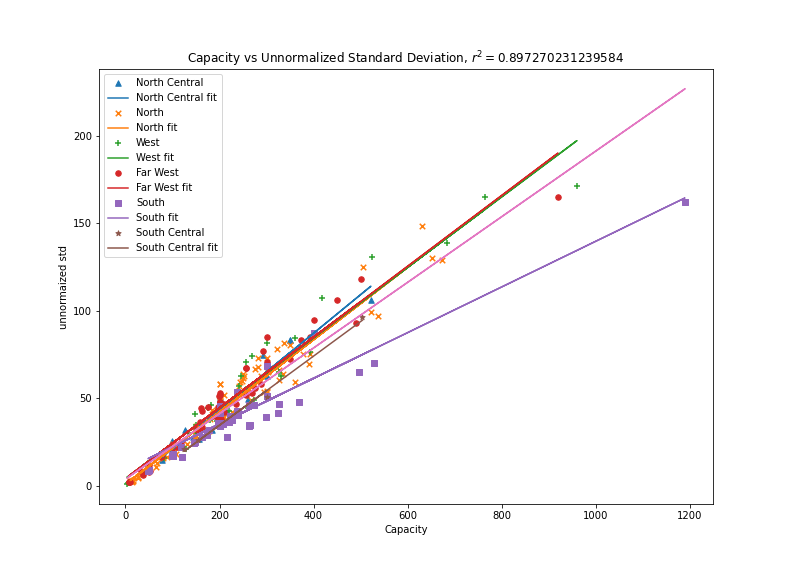
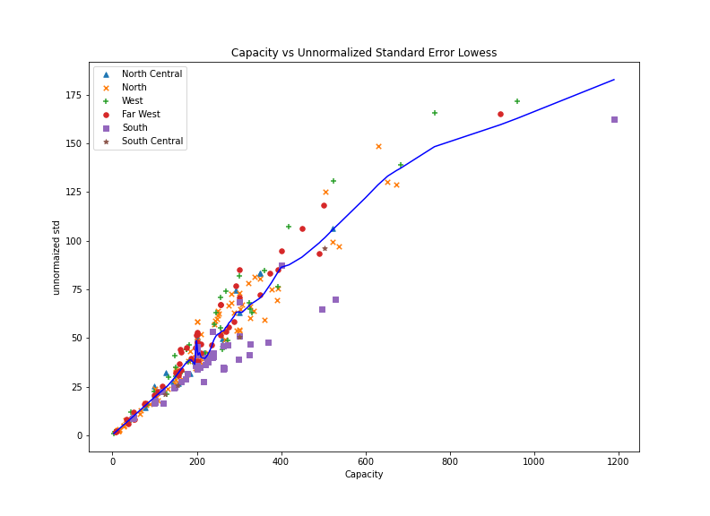
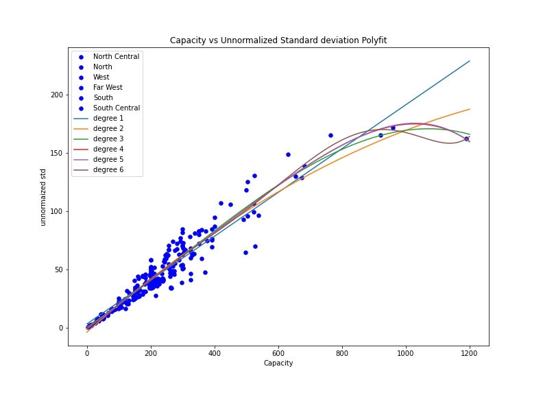
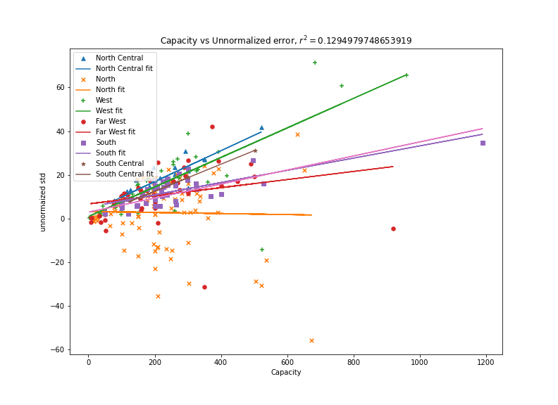

# Wind Farms Observations

## Bias

### Bias at 24 Hours interval

### Bias at each hour

- at night there is less bias
- negative bias in the south and north. positive bias in the middle
- **least bias** around 17:00-18:00

### Violin plot of bias at each hour

- two outliers at the bottom are **Canadian Breaks Wind** and **Desert Sky repower**

## Std

### Std at 24 Hours interval

- low std at the south and north, high std at the middle

### std of bias at each hour

- at the sourth std lower from midnight to noon

### Violin plot of std of bias at each hour

- low std in the afternoon and the evening

### Bump Chart of std of bias at each hour

**Kendall Coefficient of Correlation for the above bump chart**

|0-1| 1-2 | 2-3 | 3-4 | 4-5 | 5-6 | 6-7 | 7-8 | 8-9 | 9-10 | 10-11 | 11-12 | 12-13 | 13-14 | 14-15 | 15-16 | 16-17 | 17-18 | 18-19 | 19-20 | 20-21 | 21-22 | 22-23 | 23-24 |
| ----- | ----- | ----- | ----- | ----- | ----- | ----- | ----- | ----- | ----- | ----- | ----- | ----- | ----- | ----- | ----- | ----- | ----- | ----- | ----- | ----- | ----- | ----- | ----- |
|0.842 |0.871 |0.879 |0.910 |0.918 |0.918 |0.928 |0.918 |0.916 |0.916 |0.894 |0.891 |0.878 |0.833 |0.808 |0.825 |0.832 |0.853 |0.863 |0.881 |0.865 |0.846 |0.883 |

- low std farms tend to stay low, high std farms tend to stay high
- Kendall's <!-- $\tau$ -->  is higher in the morning

#### kendall's coefficient for each region

### Conclusion for these bump charts

- In general, across all regions, kendall's <!-- $\tau$ -->  is lower is the afternoon
- North Central Farms and West Farms have the highest average kendall's tau, while the South Farms have the lowest average kendall's tau.

## 95 percentile - mean (bias)

- larger in the afternoon until midnight

### Bump Charts 0-24hr

- low ones go high and high ones go low

## capacity vs unnormalized std

### Linear Regression

- there is a strong correlation (<!-- $r^2 = 0.897$ --> ) between capacity and unormalized std.
- Wind Farms at the south tend to have low unnormalized std/capacity ratio

- the correlation coefficient for North Central is 0.9349458943175288
- the correlation coefficient for North is 0.9425002375847092
- the correlation coefficient for West is 0.9502674365455899
- the correlation coefficient for Far West is 0.9477938088833047
- the correlation coefficient for South is 0.8853149787430542
- the correlation coefficient for South Central is 0.9951808329420279 (**very linear**)

### LOWESS

### Spline

### Polynomials

### Piecewise

## capacity vs unnormalized error

### Linear Regression

- the correlation is small (<!-- $r^2 = 0.1294979748653919$ --> ) so they are not quite correlated in general
- the south has higher correlation

- the correlation coefficient for North Central is 0.7747808370036084
- the correlation coefficient for North is 0.0005175873342643005
- the correlation coefficient for West is 0.6142004020550921
- the correlation coefficient for Far West is 0.07272325563154991
- the correlation coefficient for South is 0.526982981239405
- the correlation coefficient for South Central is 0.9999375913105677

### LOWESS

！[capacity vs unnorm error lowess](./plots/capacity_vs_unnormerror_lowess.png)

### Spline

## Outliers

let outliers to be any oberservation outside the range

<!-- $$
\left[Q_{1}-k\left(Q_{3}-Q_{1}\right), Q_{3}+k\left(Q_{3}-Q_{1}\right)\right]
$$ --> 

Where Q1,Q3 are the quantile, k is some non-negative constant. We use k = 2 across all the analysis

### [outliers of bias](./bias_outliers.txt)

- mostly negative bias

### [outliers of std of bias](./std_outliers.txt)

### [outliers of quantile difference](./quantile_outliers.txt)

## Things to Do
