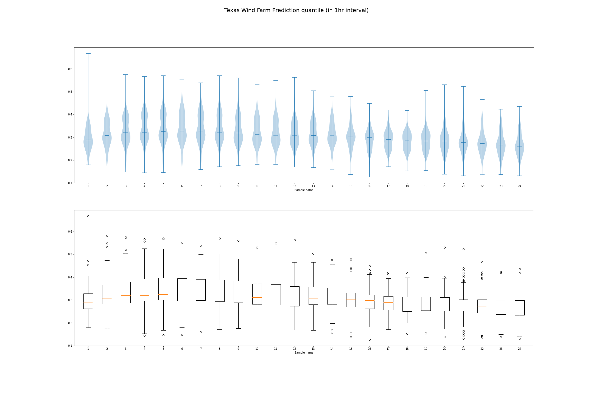

# Wind Farms Conclusions

Teo Zeng 

This document attempts to summarize all the observations from the exploratory data analysis done the forcast and actual wind farm production in Texas. 

## Notations

$$
\begin{array}{lr}
J & \text { Number of assets } \\
d=1, \ldots, D ; h & \text { Days, Hours } \\
C_i & \text{Capacity for Asset i}\\
\mathbf{g}_{d} = (g_{d,h}) & \text{Actual Production MWh}\\
\mathbf{f}_{d} = (f_{d,h}) & \text{forcasted Production MWh}\\
\tilde{\beta}_{d,h} & \text{prediction bias}\\
i & \text{assets indices}\\
\alpha_{d, h} & \text { actuals fraction } \in[0,1] \\
\gamma_{d, h} & \text { forecast fraction } \in[0,1]\\
\beta_{d,h} & \text{bias fraction} \\
q_{d,h} & \text{95 quantile fraction} \\
\mathbf{q}_{d,h} & \text{quantile}\\
\tau_{d,h} & \text{kendall's tau}\\
r^2 & \text{corelation coefficient}\\
\sigma & \text{normalized standard deviation of bias}\\
\tilde{\sigma} & \text{unnormalized standard deviation of bias}\\
S & \text{the set of all assets}\\
n & \text{number of occurence as outliers}
\end{array}
$$

- Days are indexed by $d = 1,2,...,365$, and hours are indexed by $h = 1,2,...,24$

- $\mathbf{g}_{d,h},$ $\mathbf{f}_{d,h}, \alpha_{d, h}, \beta_{d, h}, q_{d,h}$ are vectors of Dimension $J$ Where 

$$
\alpha_{d,h}\in [0,1] = \frac{\mathbf{g}_{d,h}}{C} \quad \text{and} \quad \gamma_{d,h} \in [0,1] = \frac{\mathbf{f}_{d,h}}{C}
$$

- The bias fraction is then
$$
\beta_{d,h} =  \alpha_{d,h} - \gamma_{d,h}
$$

- For a population, of discrete values or for a continuous density, the $k^{th}$ q-quantile is the data value where the cumulative distribution function crosses $k/q$. $x$ is a $k^{th}$ q-quantile for a variable $X$ if
  $$
  \operatorname{Pr}[X<x] \leq k / q \quad \text{and} \quad\operatorname{Pr}[X \leq x] \geq k / q
  $$

- For the entire article, we let $q =95$, therefore, the quantile for an asset at a given time interval is calculated as
  $$
  \mathbf{q}_{d,h} = q_{d,h} - \bar{\beta}_{d,h}
  $$
  

## Bias

### Bias at hourly interval

For a given asset, let 
$$
\beta_{h} = \frac{1}{365}\sum_{d = 1}^{365} \beta_{d,h}
$$

and $\beta_h$ is the prediction bias for a given hour of the day. For each $h \in [1,24]$, we plot out $\beta_h$ in a violin plot and a box plot.

The blue line on the violin plot and the red line on the box plot represent the median of the data. It was found that, overall in the morning the prediction bias tend to be positive, with negatively skewed distribution. In the afternoon and evening the prediction bias tend to be negative, with less skewed distribuiton. With closer analysis on the outliers, two outliers at the bottom from hour 3 to hour 19 are due to  **Canadian Breaks Wind** and **Desert Sky repower**. 

### Bias at 24 Hours interval

We are also interested in the geographic distribution of the prediction bias.

For a given asset, let 
$$
\beta = \frac{1}{365\times 24}\sum_{d = 1}^{365} \sum_{h = 1}^{24} \beta_{d,h}
$$
and $\beta$ is also a vector of length $J$. Plotting $\beta$ on the map of Texas,

As observed from the scatter plot, the bias, across all hours and all year, is relatively higher for Southern and central wind farms and is lower for Northern and Western windfarms. 

## Stardard Deviation of Bias

### Standard Deviation of Bias at Hourly Interval

We are also interested in the standard deviation of the Bias. Let
$$
\sigma_{h}=\sqrt{\frac{\sum_{d = 1}^{365}\left(\beta_{d,h}-\bar{\beta_h}\right)^{2}}{365}}
$$
where $\bar{\beta_h} = \frac{1}{365}\sum_{d = 1}^{365} \beta_{d,h}$ is the mean of the bias at a given hour across all year. For each $h \in [1,24]$, we plot out $\sigma_h$ in a violin plot and a box plot.

It was found that, from the above violin/box plot, the mean and median of the standard deviation of bias tend to be stable across 24 hours. There are some outliers during sunlight time and few outliers at night. It was also found that the standard deviation of bias tend to be larger in the early morning comparing to the afternoon.

### Standard Deviation of Bias at 24 hour interval

We are also interested in the geographic distribution of the standard deviation of bias.

For a given asset, let 
$$
\sigma=\sqrt{\frac{\sum_{h = 1}^{24}\sum_{d = 1}^{365}\left(\beta_{d,h}-\bar{\beta}\right)^{2}}{365}}
$$
where $\bar{\beta} = \frac{1}{365\times 24}\sum_{h = 1}^{24}\sum_{d = 1}^{365} \beta_{d,h}$ is the mean of the bias across all year and all hours. $\sigma$ is also a vector of length $J$. 

From this scatter plot, it was found that the stardard devaition of bias is relatively lower for the Southern assets. 

## Quantile of Bias

### Quantile of Bias at Hourly Interval

We are also interested in how the quantile of bias of each assets behave across the day. For each $h \in [1,24]$, we plot out $\mathbf{q}_h$ in a violin plot and a box plot.

We see that, from the above violin and box plot, except at hour 24, the distribution of quantiles are similar across most of the day time. During early morning to noon, most of the outliers occurs at the tail of distribution. At hour 24, the quantile is lower comparing to other hours.

### Quantile at 24 Hour Interval

We are also interested in how $\mathbf{q}$ is distribution geographically across all assets, we know that $\mathbf{q}$ is vector of length $J$. Plotting $\mathbf{q}$ on the map of Texas, we get the following

As shown on the above quantile plot, we see that there is no apparent spatial relationship across assets on quantile. Some assets at the Southwest boarder of texas tend to have lower quantile. 

## kendall's Coefficient for Each Region

We are also interested in the ordinal correlation of $\sigma$ between each asset across hours. Since there are a total of 6 regions texas and $S$ is the entire set of assets. Let 
$$
S = \{ S_1, S_2, S_3, S_4, S_5,S_6\}
$$
Where $S_i, i \in \{1,2,3,4,5,6\}$ is the set of assets in a particular region. And let
$$
\tau_i^{h}=\frac{2}{|S_i|(|S_i|-1)} \sum_{m<n, m,n \in S_i} \operatorname{sgn}\left(\sigma_{m}^{h}-\sigma_{n}^{h}\right) \operatorname{sgn}\left(\sigma_{m}^{h+1}-\sigma_{n}^{h+1}\right)
$$
So $\tau_i^{h+1}$ is the kendall correlation coefficient for asset $S_i$ during hour interval $[h,h+1]$. Then for $h \in [1,23]$ and for$  i \in \{ 1,2,3,4,5,6\}$  we plot out the kendall correlation for each region across 23 hour intervals,

We also calculated the overall kendall correlation coefficient $\tau^h$ by
$$
\tau^{h}=\frac{2}{|S|(|S|-1)} \sum_{m<n, m,n \in S} \operatorname{sgn}\left(\sigma_{m}^{h}-\sigma_{n}^{h}\right) \operatorname{sgn}\left(\sigma_{m}^{h+1}-\sigma_{n}^{h+1}\right)
$$

As seen from the plot, overall, the kendall's $\tau$ tend to be lower in the afternoon comparing to the mornings. It was also found that the assets in the South behave unsual comparing to other regions, its kendall's $\tau$ is lowest at hour 13.

## Capacity vs.  std of unnormalized bias

We are also interested in the correlation between an asset's capacity and the standard deviation of unormalized bias. Let
$$
\tilde{\sigma}= \sqrt{\frac{\sum_{h = 1}^{24}\sum_{d = 1}^{365}\left(\tilde{\beta}_{d,h}-\bar{\tilde{\beta}}\right)^{2}}{365}}
$$
Plotting Capacity $C$ on the x-axis and $\tilde{\sigma}$ on the y axis, we calculate the corelation coefficient $r^2$ 
$$
r=\frac{\sum_{i = 1}^J\left(\sigma_{i}-\bar{\sigma}\right)\left(C_{i}-\bar{C}\right)}{\sqrt{\sum_{i = 1}^J\left(\sigma_{i}-\bar{\sigma}\right)^{2} \sum\left(C_{i}-\bar{C}\right)^{2}}}
$$
where $\bar{\sigma} = \frac{1}{J} \sum_{i = 0}^J \sigma_i$ and $\bar{C} = \frac{1}{J} \sum_{i = 0}^J C_i$

It was calculated that $r^2 = 0.897$ indicating a relatively strong linear relationship. However, from the scatter plot we can see that the linear relationship is strong for $C < 450$ . It was also observed that for $C>450$ There is a clearly non linear pattern. Besdies, the assets in the south has lower std/capacity ratio comparing to other regions. Therefore, we use a local regression to make a better fit of the data.

With the weight function
$$
w(x)=\left(1-|d|^{3}\right)^{3}
$$
where $d$ is the distance of a given data point from the point on the curve being fitted, scaled to lie in the range from 0 to 1. We also specify the loss function as 
$$
\operatorname{RSS}_{x}(A)=\sum_{i=1}^{N}\left(y_{i}-A \hat{x}_{i}\right)^{T} w_{i}(x)\left(y_{i}-A \hat{x}_{i}\right) .
$$
Here, $A$ is an $(n+1) \times(n+1)$ real matrix of coefficients, $w_{i}(x):=w\left(x_{i}, x\right)$ and the subscript $i$ enumerates input and output vectors from a training set.

## Outliers

Let outliers to be any oberservation outside the range
$$
\left[q^{25}-k\left(q^{75}-q^{25}\right), q^{75}+k\left(q^{75}-q^{25}\right)\right]
$$
Where $q^{25},q^{75}$ are the 25 quantile and 75 quantile respectively, $k$ is some non-negative constant. We use $k=2$ across all the analysis

### Bias Outliers

We count the number of occurence as outliers of each assets across assets for bias.
$$
\begin{aligned}
&\text { Bias Butliers }\\
&\begin{array}{|l|r|}
\hline \text{Asset} & n_\beta \\
\hline \text { Desert Sky repower } & 19 \\
\hline \text { Canadian Breaks Wind } & 18 \\
\hline \text { Tierra Blanca W } & 16 \\
\hline \text { Broadview Energy JN LLC } & 16 \\
\hline \text { Northdraw Wind } & 16 \\
\hline \text { Wildrose Wind } & 15 \\
\hline \text { Wind Power Partners '94 Wind Farm } & 14 \\
\hline \text { Delaware Mountain Wind Farm } & 14 \\
\hline \text { Gusty Hill Wind } & 14 \\
\hline \text { Pantex Plant Wind Project } & 13 \\
\hline
\end{array}
\end{aligned}
$$

### Standard Deviation Outliers

We count the number of occurence as outliers of each assets across assets for standard deviation of bias.
$$
\begin{aligned}
&\text { Standard Deviation Outliers }\\
&\begin{array}{|l|r|}
\hline \text{Asset} & n_\sigma \\
\hline \text { Cameron } & 10 \\
\hline \text { Anacacho Wind Farm } & 10 \\
\hline \text { San Roman } & 8 \\
\hline \text { Bruenning's Breeze } & 8 \\
\hline \text { Magic Valley } & 8 \\
\hline \text { Gulf Wind Farm } & 7 \\
\hline \text { Penascal II } & 7 \\
\hline \text { Baffin } & 6 \\
\hline \text { Tecovas } 1 \text { W } & 5 \\
\hline \text { Papalote Creek } & 5 \\
\hline
\end{array}
\end{aligned}
$$

### Quantile Outliers

We count the number of occurence as outliers of each assets across assets for quantile.
$$
\begin{aligned}
&\text { Quantile Outliers }\\
&\begin{array}{|l|r|}
\hline \text{ Asset} & n_\mathbf{q} \\
\hline \text { Gusty Hill Wind } & 17 \\
\hline \text { Anacacho Wind Farm } & 14 \\
\hline \text { Wind Power Partners '94 Wind Farm } & 14 \\
\hline \text { Delaware Mountain Wind Farm } & 13 \\
\hline \text { Desert Sky repower } & 13 \\
\hline \text { Loma Pinta II } & 12 \\
\hline \text { Loma Pinta Wind } & 12 \\
\hline \text { West Texas Windplant } & 11 \\
\hline \text { Canadian Breaks Wind } & 8 \\
\hline
\end{array}
\end{aligned}
$$
For the above tables, we see that **Desert Sky repower** has large bias and quantile, but not standard deviation. The assets on the bias and quantile tend to align, but large quantile or bias does not mean they have large standard deviation.

## References
