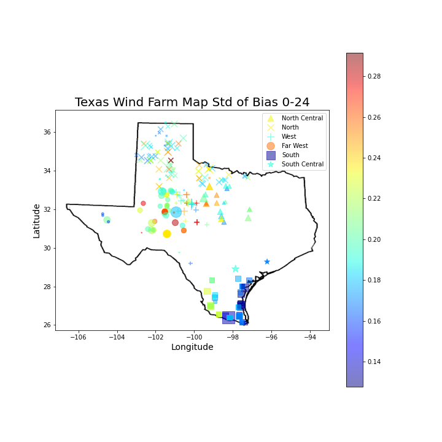
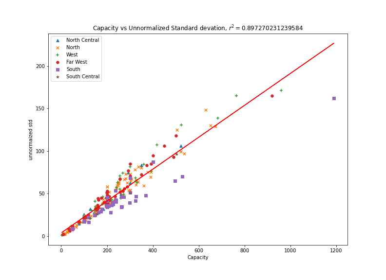

# Wind Farms Conclusions

This document attempts to summarize all the observations from the exploratory data analysis.

## Notations

$$
\begin{array}{lr}
J & \text { Number of assets } \\
d=1, \ldots, D ; h & \text { Days, Hours } \\
C_i & \text{Capacity for Asset i}\\
\mathbf{g}_{d} = (g_{d,h}) & \text{Actual Production MWh}\\
\mathbf{f}_{d} = (f_{d,h}) & \text{forcasted Production MWh}\\
\tilde{\beta}_{d,h} & \text{prediction bias}\\
i & \text{assets indices}\\
\alpha_{d, h} & \text { actuals fraction } \in[0,1] \\
\gamma_{d, h} & \text { forecast fraction } \in[0,1]\\
\beta_{d,h} & \text{bias fraction} \\
\tau_{d,h} & \text{kendall's tau}\\
r^2 & \text{corelation coefficient}\\
\sigma & \text{normalized standard deviation of bias}\\
\tilde{\sigma} & \text{unnormalized standard deviation of bias}\\
S & \text{the set of all assets}\\
\end{array}
$$

- Days are indexed by $d = 1,2,...,365$, and hours are indexed by $h = 1,2,...,24$

- $\mathbf{g}_{d,h},$ $\mathbf{f}_{d,h}, \alpha_{d, h}, \beta_{d, h}$ are vectors of Dimension $J$ Where 

$$
\alpha_{d,h}\in [0,1] = \frac{\mathbf{g}_{d,h}}{C} \quad \text{and} \quad \beta_{d,h} \in [0,1] = \frac{\mathbf{f}_{d,h}}{C}
$$

- The bias fraction is then
$$
\beta_{d,h} = \gamma_{d,h} - \alpha_{d,h}
$$

## Bias

### Bias at hourly interval

For a given asset, let 
$$
\beta_{h} = \frac{1}{365}\sum_{d = 1}^{365} \beta_{d,h}
$$

and $\beta_h$ is the prediction bias for a given hour of the day. For each $h \in [1,24]$, we plot out $\beta_h$ in a violin plot and a box plot.

It was found that, overall in the morning the prediction bias tend to be positive, with negatively skewed distribution. In the afternoon and evening the prediction bias tend to be negative, with less skewed distribuiton. With closer analysis, the negative skewness in the morning is brought by **Canadian Breaks Wind** and **Desert Sky repower**. 

### Bias at 24 Hours interval

We are also interested in the geographic distribution of the prediction bias.

For a given asset, let 
$$
\beta = \frac{1}{365\times 24}\sum_{d = 1}^{365} \sum_{h = 1}^{24} \beta_{d,h}
$$
and $\beta$ is also a vector of length $J$. Plotting $\beta$ on the map of Texas,

As observed from the scatter plot, the bias, across all hours and all year, is relatively higher for Southern and central wind farms and is lower for Northern and Western windfarms. 

## Stardard Deviation of Bias

###### 

We are also interested in the standard deviation of the Bias. Let
$$
\sigma_{h}^{\beta}=\sqrt{\frac{\sum_{d = 1}^{365}\left(\beta_{d,h}-\bar{\beta_h}\right)^{2}}{365}}
$$
where $\bar{\beta_h} = \frac{1}{365}\sum_{d = 1}^{365} \beta_{d,h}$ is the mean of the bias at a given hour across all year. For each $h \in [1,24]$, we plot out $\sigma_h^{\beta}$ in a violin plot and a box plot.

It was found that, from the above violin/box plot, the mean and median of the standard deviation of bias tend to be stable across 24 hours. There are some outliers during sunlight time and few outliers at night. It was also found that the standard deviation of bias tend to be larger in the early morning comparing to the afternoon.

### Standard Deviation of Bias at 24 hour interval

We are also interested in the geographic distribution of the standard deviation of bias.

For a given asset, let 
$$
\sigma^{\beta}=\sqrt{\frac{\sum_{h = 1}^{24}\sum_{d = 1}^{365}\left(\beta_{d,h}-\bar{\beta}\right)^{2}}{365}}
$$
where $\bar{\beta} = \frac{1}{365\times 24}\sum_{h = 1}^{24}\sum_{d = 1}^{365} \beta_{d,h}$ is the mean of the bias across all year and all hours. $\sigma$ is also a vector of length $J$. Plotting $\sigma$ on the map of Texas, we have

From this scatter plot, it was found that the stardard devaition of bias is relatively lower for the Southern assets. 

## kendall's Coefficient for Each Region

We are also interested in the ordinal correlation of $\sigma$ between each asset across hours. Since there are a total of 6 regions texas and $S$ is the entire set of assets. Let 
$$
S = \{ S_1, S_2, S_3, S_4, S_5,S_6\}
$$
Where $S_i, i \in \{1,2,3,4,5,6\}$ is the set of assets in a particular region. And let
$$
\tau_i^{h+1}=\frac{2}{|S_i|(|S_i|-1)} \sum_{m<n, m,n \in S_i} \operatorname{sgn}\left(\sigma_{m}^{h}-\sigma_{n}^{h}\right) \operatorname{sgn}\left(\sigma_{m}^{h+1}-\sigma_{n}^{h+1}\right)
$$
So $\tau_i^{h+1}$ is the kendall correlation coefficient for asset $S_i$ during hour interval $[h,h+1]$. Then for $h \in [1,23]$ and for$  i \in \{ 1,2,3,4,5,6\}$  we plot out the kendall correlation for each region across 23 hour intervals,

As seen from the plot, overall, the kendall's $\tau$ tend to be lower in the afternoon comparing to the mornings. It was also found that the assets in the South behave unsual comparing to other regions, its kendall's $\tau$ is lowest at hour 13.

## Capacity vs.  std of unnormalized bias

We are also interested in the correlation between an asset's capacity and the standard deviation of unormalized bias. Let
$$
\tilde{\sigma}= \sqrt{\frac{\sum_{h = 1}^{24}\sum_{d = 1}^{365}\left(\tilde{\beta}_{d,h}-\bar{\tilde{\beta}}\right)^{2}}{365}}
$$
Plotting Capacity $C$ on the x-axis and $\tilde{\sigma}$ on the y axis, we calculate the corelation coefficient $r^2$ 
$$
r=\frac{\sum_{i = 1}^J\left(\sigma_{i}-\bar{\sigma}\right)\left(C_{i}-\bar{C}\right)}{\sqrt{\sum_{i = 1}^J\left(\sigma_{i}-\bar{\sigma}\right)^{2} \sum\left(C_{i}-\bar{C}\right)^{2}}}
$$
where $\bar{\sigma} = \frac{1}{J} \sum_{i = 0}^J \sigma_i$ and $\bar{C} = \frac{1}{J} \sum_{i = 0}^J C_i$

It was calculated that $r^2 = 0.897$ indicating a relatively strong linear relationship. However, from the scatter plot we can see that the linear relationship is strong for $C < 450$ . It was also observed that for $C>450$ There is a clearly non linear pattern. Besdies, the assets in the south has lower std/capacity ratio comparing to other regions.

## References
